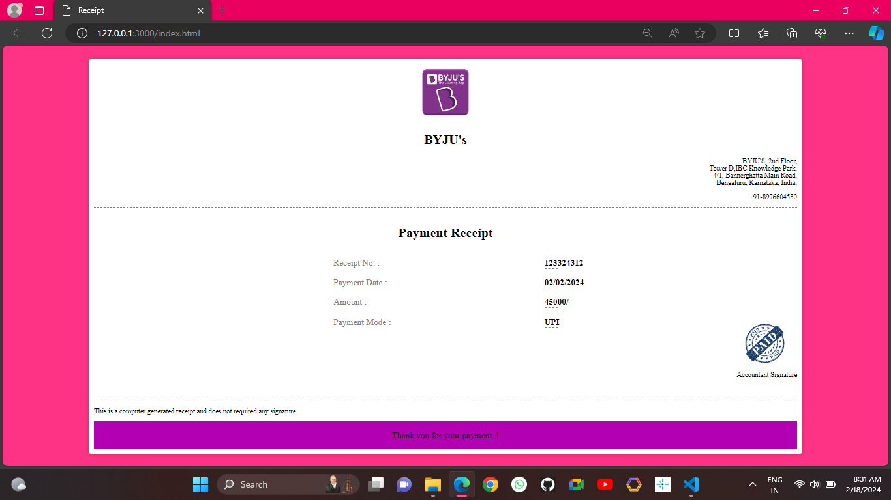

# Receipt  
A receipt is a document acknowledging that a person has received money or property in payment. All receipts must have the date of purchase on them.

---

---
## Use Of The Receipt ..

To provide proof of purchase and payment made by customers. These receipts are sent directly to the customer's email inbox, and can be accessed from anywhere, anytime.

---
## How To Contributes ..
We Welcome Contributions from the community to help us expand and improve this handbook. If you would like to contributes, follow these steps:

1.Fork the repository to your GitHub account.

2.Make your changes, add new content, or fix any existing issues.

3.Open a new pull request i this repository.

